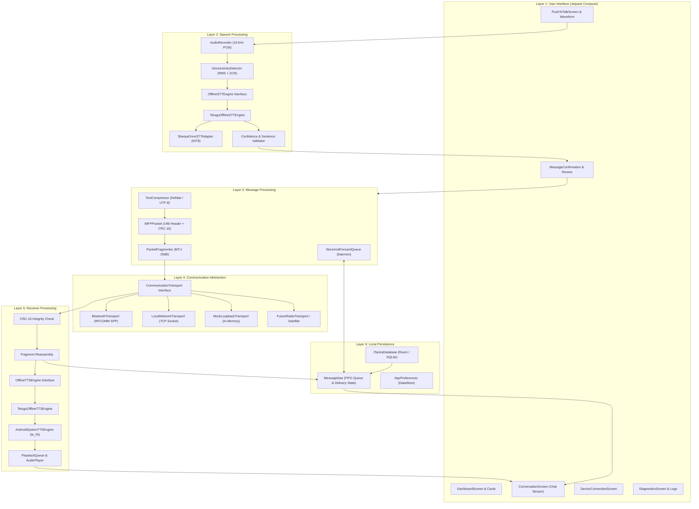

# iTantra — 6-Layer Modular Architecture

iTantra is designed strictly with Clean Architecture and separation of concerns across 6 distinct layers. No layer directly couples speech processing with communication hardware.

---

## 🏗️ Architectural Diagram

---

## Layer Responsibilities

### Layer 1: User Interface
- Lightweight, high-contrast Jetpack Compose interface with Material 3.
- Large tactile PTT button with real-time waveform feedback.
- Low-confidence review dialog safeguarding against unintelligible voice transmissions.

### Layer 2: Speech Processing
- **Audio Capture**: `AudioRecord` configured for 16,000 Hz, 16-bit linear PCM, mono channel in 30 ms chunks (480 samples).
- **VAD Gating**: Root-mean-square energy:
  $$E = \sqrt{\frac{1}{N}\sum_{n=0}^{N-1} x[n]^2}$$
  Silence threshold ($E < 450.0$) with a 600 ms hangover timer prevents cutting off the final words of a sentence.
- **Indic ASR Engine**: INT8 quantized Conformer-CTC model with CTC greedy decoder and Telugu language dictionary.

### Layer 3: Message Processing
- **iMFP Binary Framing**: 14-byte compact header containing version, priority flags, language ID, sequence counter, node hashes, payload size, and CRC-16.
- **Adaptive Compression**: Analyzes payload size; messages under 35 bytes bypass compression to avoid dictionary overhead, while larger messages are compressed using Deflate.
- **Fragmentation**: Slices payloads exceeding link MTU (256 bytes) with fragment headers and handles out-of-order reassembly.

### Layer 4: Communication Abstraction
- Completely decouples the AI and message layers from physical radio hardware.
- Replaceable transport classes implementing `CommunicationTransport`:
  - `BluetoothTransport` (Android Bluetooth RFCOMM SPP)
  - `LocalNetworkTransport` (Wi-Fi Direct / Local Hotspot TCP Sockets)
  - `MockLoopbackTransport` (In-memory loopback for instant unit and single-device verification)

### Layer 5: Receiver Processing
- Frame validation with CRC-16 checksum.
- Synthesizes received text using local Indic TTS (VITS / Android system offline voice).
- Sequential `PlaybackQueue` with emergency preemption.

### Layer 6: Local Persistence
- Room Database (`iTantraDatabase`) tracking full message lifecycle: `DRAFT` $\rightarrow$ `QUEUED` $\rightarrow$ `SENDING` $\rightarrow$ `SENT` $\rightarrow$ `DELIVERED` or `PENDING` / `FAILED`.
