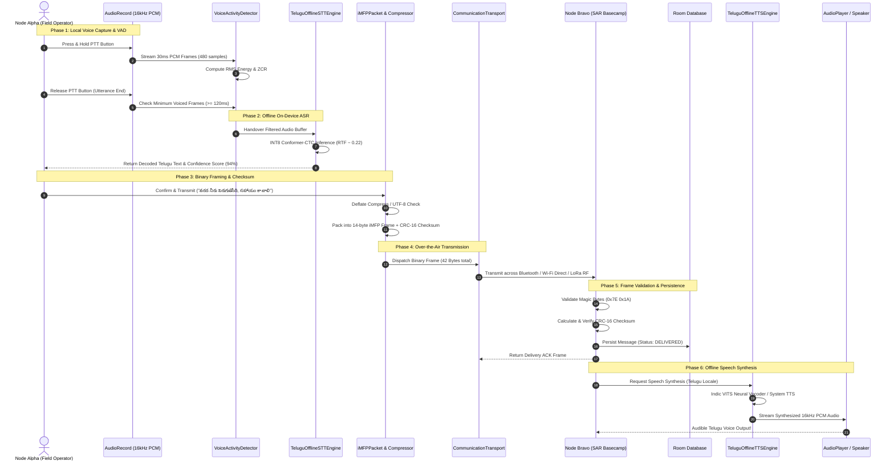

# iTantra — End-to-End Sequence Diagram

The complete transmission pipeline: User Speech $\rightarrow$ Offline STT $\rightarrow$ Compact Text $\rightarrow$ Low-Bitrate Radio Link $\rightarrow$ Offline TTS $\rightarrow$ Receiver Speech.

